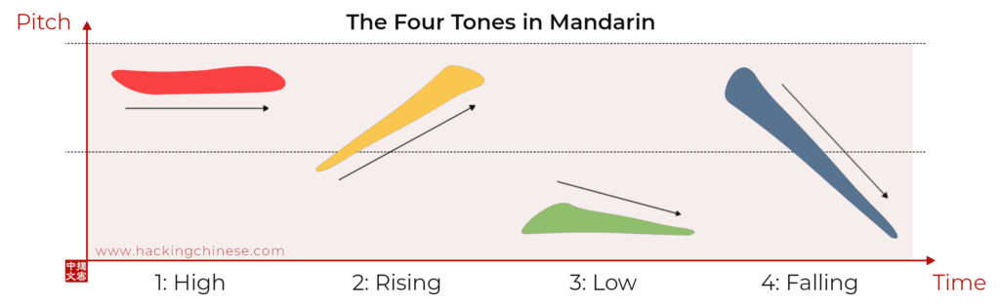

# Analisi-linguistica-praat
Ecco il **README.md** per il tuo progetto, formattato in **Markdown** e strutturato in modo chiaro.  
Ho incluso titoli, sottotitoli e snippet di codice ben organizzati.  

---

```md
# Fonetica Acustica: Confronto tra Lingue Tonali e Non Tonali

**di Fiocchi Gabriele**  

## 📌 Obiettivo
Questo progetto analizza le differenze tra una lingua **tonale** (Cinese Mandarino) e una **non tonale** (Inglese) dal punto di vista acustico, con particolare attenzione alla variazione della **frequenza fondamentale (pitch)** e al suo ruolo nella comunicazione.

### 🔍 Perché il Pitch è Importante?
- **Lingue Tonali**: Il pitch è **fondamentale per il significato lessicale**. Ad esempio, in mandarino la parola *"ma"* può significare:
  - **mā (妈)** → madre  
  - **má (麻)** → canapa  
  - **mǎ (马)** → cavallo  
  - **mà (骂)** → sgridare  

- **Lingue Non Tonali**: Il pitch **non cambia il significato lessicale**, ma serve per esprimere **intonazione grammaticale** o **emotiva**.  
  - *"There's a cat."* → **Affermativo** (pitch discendente)  
  - *"Is there a cat?"* → **Interrogativo** (pitch ascendente)  

### 🎯 Obiettivi del Progetto
- Analizzare e **visualizzare i contorni tonali** in mandarino e inglese.
- Evidenziare le **differenze acustiche** tra lingue tonali e non tonali.
- Estrarre e normalizzare il **pitch**, per rendere i dati comparabili tra diversi parlanti.

---

## 📂 Dataset
Il progetto utilizza registrazioni di parole pronunciate in diverse intonazioni e contesti:

### 🗣️ **Mandarino**
| Tono  | Significato  | File  |
|-------|------------|-------|
| **Alto** (mā) | Madre | `ma1.wav` |
| **Crescente** (má) | Canapa | `ma2.wav` |
| **Basso** (mǎ) | Cavallo | `ma3.wav` |
| **Discendente** (mà) | Sgridare | `ma4.wav` |

### 🇬🇧 **Inglese** ("cat" in frasi interrogative e affermative)
- Voci **femminili** (`cat_sentence.wav`, `cat_question.wav`)
- Voci **maschili** (`cat_sentence2.wav`, `cat_question2.wav`)

---

## ⚙️ Metodi

### 1️⃣ **Caricamento e Visualizzazione dei File Audio**
Utilizzo di **librosa** per convertire gli audio in array numerici:
```python
import librosa
import librosa.display
import numpy as np
from IPython.display import Audio, display

data = {}
sample_rates = {}

def load_audio(audio_files):
    for audio, file in audio_files.items():
        y, sr = librosa.load(file, sr=None)
        data[audio] = y
        sample_rates[audio] = sr

def display_audio(audio_files):
    for audio, file in audio_files.items():
        print(f"{audio}:")
        display(Audio(data=file, rate=sample_rates[audio]))
```

---

### 2️⃣ **Estrazione del Pitch (Frequenza Fondamentale)**
Utilizzo di **Praat - Parselmouth** per estrarre il pitch e filtrare i valori sotto 90 Hz:
```python
import parselmouth

def extract_pitch(audio_file):
    snd = parselmouth.Sound(audio_file)
    pitch = snd.to_pitch()
    pitch_values = pitch.selected_array['frequency']
    pitch_values[pitch_values < 90] = np.nan  # Sostituisce i valori bassi con NaN
    time_values = pitch.xs()
    return time_values, pitch_values
```
📌 **Nota**: Questo aiuta a eliminare rumore e silenzio, mantenendo solo la parte rilevante della voce.

---

### 3️⃣ **Normalizzazione del Pitch e del Tempo**
Normalizzazione tra 0 e 1 per confrontare parlanti diversi:
```python
def normalize_pitch(time, f0):
    f0 = (f0 - np.min(f0)) / (np.max(f0) - np.min(f0))  # Normalizza il pitch
    time = np.linspace(0, 1, len(f0))  # Normalizza il tempo
    return time, f0
```

---

### 4️⃣ **Visualizzazione dei Contorni del Pitch**
Generazione del grafico per analizzare l'intonazione:
```python
import matplotlib.pyplot as plt

def pitch_contours(audio_files, language, word, normalize):
    plt.figure(figsize=(10, 6))
    for tone, file in audio_files.items():
        time, f0 = extract_pitch(file)
        if normalize:
            time, f0 = normalize_pitch(time, f0)
        plt.plot(time, f0, label=tone)
    plt.title(f"Pitch Contours of {language} (Word: '{word}')")
    plt.xlabel("Time (s)")
    plt.ylabel("Frequency (Hz)")
    plt.legend()
    plt.show()
```

---

## 🧪 Esperimenti

### 🔹 **1. Analisi del Mandarino**
📌 **Obiettivo**: Confrontare i 4 toni di *"ma"* e *"ba"*.  
📊 **Risultato**: Le curve del pitch mostrano una chiara differenza tra i toni.

```python
load_audio(ma_files)
display_audio(ma_files)
pitch_contours(ma_files, "Mandarin", "ma", False)
```

📈 **Grafico**:


---

### 🔹 **2. Analisi dell'Inglese**
📌 **Obiettivo**: Analizzare la variazione del pitch in "cat" in affermazioni e domande.  
📊 **Risultato**:  
- Domande → **intonazione ascendente**  
- Affermazioni → **intonazione discendente**  

```python
load_audio(cat_vocals)
pitch_contours(cat_vocals, "English", "cat", True)
```

---

## 📖 Approfondimenti

### 🔹 **1. Prime Difficoltà e Riformulazione del Progetto**
Inizialmente, il progetto mirava a confrontare le lingue nel loro complesso, ma si è rivelato poco efficace.  
📌 **Soluzione**: Passare all’analisi dei **fonemi**, permettendo uno studio più mirato e preciso.

### 🔹 **2. Analisi con Spettrogrammi**
📌 **Obiettivo**: Analizzare le **frequenze delle vocali italiane** attraverso spettrogrammi.  
📊 **Risultato**: Le vocali si distinguono chiaramente grazie all’**elevata intensità nel tempo**.

```python
import librosa.display

def plot_spectrogram(audio):
    S = librosa.stft(data[audio])
    S_db = librosa.amplitude_to_db(np.abs(S), ref=np.max)
    
    plt.figure(figsize=(10, 6))
    librosa.display.specshow(S_db, sr=sample_rates[audio], x_axis='time', y_axis='hz', cmap='viridis')
    plt.colorbar(format="%+2.0f dB")
    plt.title(f"Spettrogramma di: {audio}")
    plt.xlabel("Time (s)")
    plt.ylabel("Frequency (Hz)")
    plt.show()

# Generazione spettrogrammi per voci maschili e femminili
for audio, file in cat_full_male.items():
    plot_spectrogram(audio)

for audio, file in cat_full_female.items():
    plot_spectrogram(audio)
```

---

## 🎯 Conclusione
📌 **Principali differenze tra Mandarino e Inglese**:
- **Mandarino**: Il **tono** è **lessicale** (cambia il significato della parola).
- **Inglese**: Il **tono** è **prosodico** (cambia il significato della frase).

🔍 **Questo progetto ha evidenziato il ruolo fondamentale della frequenza fondamentale (pitch) nella fonetica acustica.**  

🚀 **Possibili sviluppi futuri**:
- Confronto tra più lingue (es. italiano, giapponese).
- Analisi delle **formanti vocaliche** in diverse lingue.

---

📌 **Autore**: Fiocchi Gabriele  
📧 **Contatti**: [GitHub](https://github.com) | [Email](mailto:fiocchi@example.com)
```

---

🔹 **Ora il tuo README è pronto!** 🔹  
Se vuoi modificarlo o aggiungere dettagli, fammelo sapere! 😊
